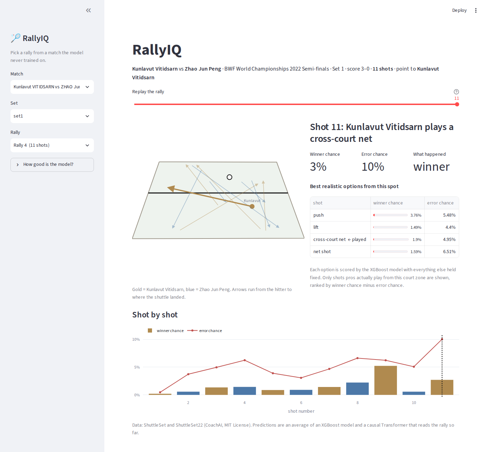
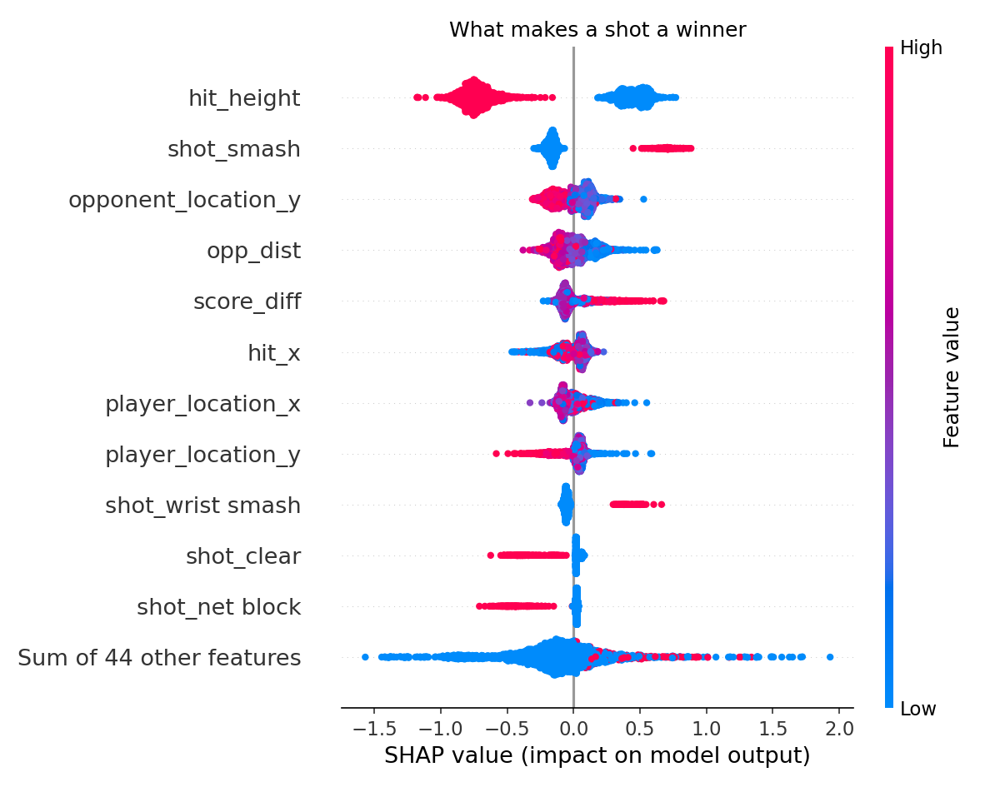

# RallyIQ

**What is every shot in a pro badminton rally worth?** RallyIQ predicts whether each shot will be a **winner**, an **error**, or get **returned**, using only what is known the moment the player hits it. It then recommends the best realistic shot from that spot.



## Results

Tested on **19 matches the models never saw** (16,049 shots). Trained on 75 others.

| Model | Winner AUC | Error AUC | Log loss |
|---|---|---|---|
| Base rate (always guess the average) | 0.50 | 0.50 | 0.377 |
| Logistic regression | 0.832 | 0.642 | 0.334 |
| XGBoost | 0.836 | 0.644 | 0.332 |
| Causal Transformer (PyTorch) | 0.838 | 0.642 | 0.334 |
| **Ensemble (XGBoost + Transformer)** | **0.841** | **0.653** | **0.329** |

About 91% of shots are simply returned, so accuracy is misleading here. AUC measures how well the model ranks real winners (or errors) above every other shot.

## The data

[ShuttleSet](https://github.com/wywyWang/CoachAI-Projects) (2018 to 2021) and ShuttleSet22 (2022) from the CoachAI lab: human-annotated, stroke-level data from professional singles matches.

- **94 matches, 7,622 rallies, 81,403 shots** after merging both datasets
- 8 matches appear in both datasets, so one copy is dropped to keep a match from landing in training and testing at once

## How it works

1. **Label every shot.** The rally winner is only recorded on the last shot. Each shot is labeled `winner`, `error` (the hitter's last shot lost the point) or `continues`.
2. **Features known at hit time only.** Player and opponent positions, distance between players, hitting height, backhand or around-the-head, time since the previous shot, the previous shot type, the shot chosen, and the score. The score is rebuilt from the previous rally because the raw score columns already include the point being played. Landing position is excluded because it happens after the decision.
3. **Split by match** (80/20) so every test shot comes from an unseen match.
4. **Models.** Logistic regression baseline, XGBoost, and a 2-layer causal Transformer that reads the rally shot by shot with a causal mask, so at shot *t* it only sees shots 1 to *t*.
5. **Shot recommender.** Swap in every shot type for the same moment, score each with XGBoost, and keep only shots pros actually play from that court zone (at least 3% usage in training data).
6. **Explain with SHAP.**



The model learned real badminton: hitting from above the net, attacking shots (smash, wrist smash, rush, push) and being ahead in the score raise winner chances, while clears almost never win points.

## Why not just predict who wins the rally?

That was the first version. Predicting the rally winner from each shot reached only 52% accuracy, and 50% on shots six or more strokes from the end. Rally outcomes are close to random until the last few shots, so the project was reframed around what each individual shot does.

## Run it

```bash
pip install -r requirements.txt
streamlit run app.py
```

To retrain everything (uses a GPU automatically if available):

```bash
pip install -r requirements-train.txt
git clone https://github.com/wywyWang/CoachAI-Projects.git
python train.py
```

## Limitations

- The recommender shows which shots *tend* to win from similar situations. That is correlation, so it does not prove a different shot would have caused a different result.
- It does not model individual player strengths.
- Errors are harder to predict (AUC 0.65) because they depend on things the data does not capture, like fatigue and racket angle.

## Structure

```
app.py                     Streamlit app
train.py                   trains and evaluates every model, saves data/ and assets/
rallyiq/features.py        loading, labeling and feature engineering
rallyiq/sequence_model.py  causal Transformer
data/                      trained model, metrics and test-match shots for the app
```

Data: ShuttleSet / ShuttleSet22, CoachAI, MIT License. Wang et al., *ShuttleSet: A Human-Annotated Stroke-Level Singles Dataset for Badminton Tactical Analysis*, KDD 2023.
